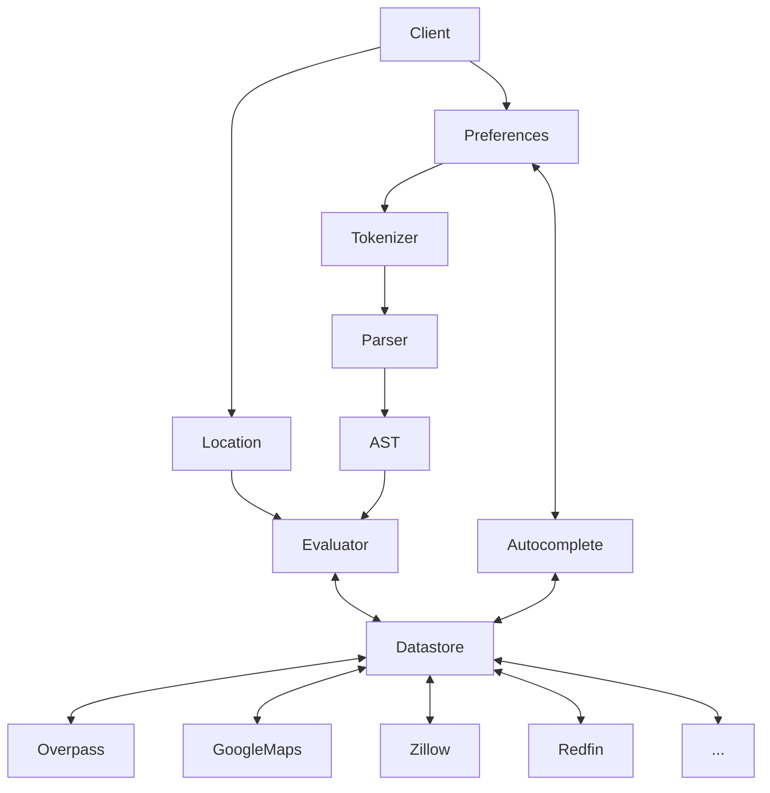

# Nest Quest

This project intends to help identify if a potential home meets your requirements. Users configure their preferences in a tree structure. These preferences include conditional statements as well as arithmetic operators and distance values. This tree can then be used to evaluate a target location using various providers such as Open Street Map.

## Getting Started
To run this project locally, start by cloning this repo. There are multiple microservices, but all of them are included in this monorepo for now. Assuming you have Docker and Docker Compose installed, you can start the stack with:
> docker compose up

I prefer to also include the `detach` and `build` flags to ensure the latest code is being rebuilt each time:
> docker compose up -d --build

Once this is running, you should be able to navigate to `http://localhost/` in your browswer and see the web client running.

### Installing Packages
While the Dockerfiles handle running the existing application, if you want to install any additional packages you will need the [.NET SDK](https://dotnet.microsoft.com/en-us/download) (preferably v9+) and [pnpm](https://pnpm.io/installation) (preferably v10.8+) installed locally.

## Architecture

TODO

The architecture for this project can be decomposed into several subsystems and/or components:
- Client for user preference input. This could take several forms, such as a website, CLI, or browser extension. Regardless of the implementation each client would adhere to the same general structure and interface with the same APIs.
- Lexer/tokenizer for user preferences, which are passed in as a string.
- Parser that converts tokens into an AST.
- Weight calculator using AHP, Paired Comparisons, or Reference Comparisons (http://www2.mitre.org/work/sepo/toolkits/STEP/files/ScoringMethodsContent.pdf).
- Evaluators that evaluate a given location against the AST, returning a utility score. This should be generalized to allow multiple evaluator implementations, e.g. Overpass, Google Maps, Apple Maps, etc.
- Datastore that manages retrieval and storage of data from external locations.

## External Dependencies

There are several external APIs used during operation of this extension.
- [OpenStreetMap taginfo](https://taginfo.openstreetmap.org/) for location tags
- [Maps.co](https://geocode.maps.co) for geocoding addresses to coordinates [no longer usable without API key]
- [Nominatim](https://nominatim.org) for geocoding address to coordinates
- [Overpass](https://www.overpass-api.de) for proximity calculations

## Roadmap
v0.0.1
- [x] Static webpage with fictional houses & attractions using basic drop-downs and simple OR logic for all filters

v0.0.2
Infrastructure:
- [x] Docker compose services: web client, web API, web server
- [x] Language and framework selections for all services
- [x] Web API Dockerfile
- [x] Web client Dockerfile
- [x] Web server Caddyfile for localhost
- [x] Caching for Overpass requests
- [x] Rate limiting for Overpass requests
- [x] Loading indicator while requests are being processed
- [x] Database versioning with EF code-first
- [x] Logging with Serilog
- [ ] Unit test framework(s)
- [ ] Swagger page for web API with version tag dropdown properly configured and sample parameter values
- [ ] Add version tag to web client
- [ ] Add version tag to web API headers
- [ ] Add healthcheck endpoint to web API, including version tag
Business logic:
- [x] `Criterion` object with category, tolerance, unit, and sign/direction properties (will add weights and travel mode later)
- [x] Point of interest categories defined via enum, including Unknown option
- [x] Web client to allow dynamic addition and removal of criterion objects
- [x] Web client to load critera from stored data via `GET /api/v0/criteria` endpoint
- [x] Database table `Criterion` to store criteria (will need to update this later to include user linkage)
- [x] `POST /api/v0/criteria` endpoint to store list of criteria (will eventually be replaced with comprehensive tree)
- [x] Intergrate with Overpass API to perform POI lookups
- [x] Evaluation engine to take in criteria and a target location and return a score (binary score for now, will return a continuous score later). Score is using simple distance calculation directly in Overpass query for now, this will be expanded with additional options later.
- [x] `GET /api/v0/poi` endpoint to fetch POI data by bounding box and category and mark these points on the map
- [x] `GET /api/v0/homes` endpoint to fetch home data by bounding box (returning dummy data for this version)
- [x] Simpler base map (than basic OSM tile server) for better contrast with POI and home pins
- [x] Split matching homes into a separate list from unmatched homes
- [x] Add distance unit annotation
- [x] Scale units to kilometers

v0.0.3
- [ ] Listing interface and services to fetch real property listing data from a variety of sources such as Zillow or Redfin
- [ ] "Saved Places" section for ad hoc location lookup. CRUD actions, include a geocoding step to allow address lookup.
- [ ] CI/CD
- [ ] Add expiry time for database cache entries

v0.0.4 
- [ ] Strict query language for filters, allowing text input with complex combinations instead of all OR statements and replacing prior dropdown design
- [ ] Add OR logic with Overpass query unions

v0.1.0
- [ ] Hosting model
- [ ] Full CI/CD for all deployments, including production. Maybe use blue/green deployment process?
- [ ] A/B version testing?

v0.1.1
- [ ] Add data pipeline service(s) to ingest & pre-process datasets.

v0.1.2
- [ ] Refactor evaluation engine to use pre-processed datasets?

...

v1.0.0
- [ ] Snap versions of all APIs, docker images, installers, etc.
- [ ] Configure CI/CD for production release. Minify JavaScript, possibly refactor Dockerfiles with environment-specific layers.
- [ ] Domain name
- [ ] Update Caddyfile with production URL

Backlog:
- [ ] Migrate from Docker to podman
- [ ] Server hardening: firewall config, CDN, fail2ban, VPN access
- [ ] Browser extension
- [ ] Mobile app with AR lens & map integration
- [ ] Sensitivity analysis to determine constraining criteria
- [ ] Add data with radar charts showing each listing on top of all the criteria. Dynamically generate the radar chart structure based on selected criteria
- [ ] Weights for each criterion
- [ ] Continuous scores for criteria
- [ ] Travel mode
- [ ] Convert freeform text to structured format
- [ ] Add brand and name search for Unknown categories
- [ ] Accessible onboarding survey to populate initial criteria and weights
- [ ] Pushed notifications when a home comes on the market that meets requirements
- [ ] Add dynamic tooltips (delayed hover to reveal + explicit close button) to guide users
