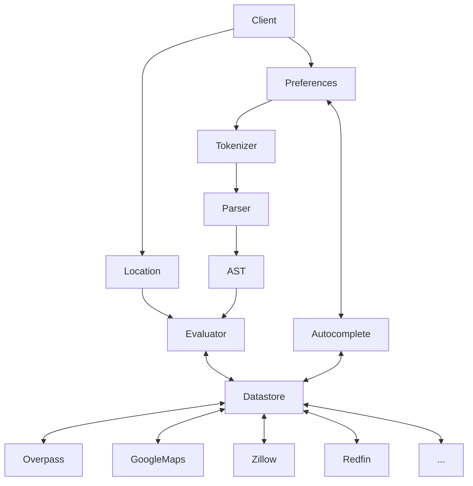

# Nest Quest

This project intends to help identify if a potential home meets your requirements. Users configure their preferences in a tree structure. These preferences include conditional statements as well as arithmetic operators and distance values. This tree can then be used to evaluate a target location using various providers such as Open Street Map.

## Architecture

The architecture for this project can be decomposed into several subsystems and/or components:
- Client for user preference input. This could take several forms, such as a website, CLI, or browser extension. Regardless of the implementation each client would adhere to the same general structure and interface with the same APIs.
- Lexer/tokenizer for user preferences, which are passed in as a string.
- Parser that converts tokens into an AST.
- Weight calculator using AHP, Paired Comparisons, or Reference Comparisons (http://www2.mitre.org/work/sepo/toolkits/STEP/files/ScoringMethodsContent.pdf).
- Evaluators that evaluate a given location against the AST, returning a utility score. This should be generalized to allow multiple evaluator implementations, e.g. Overpass, Google Maps, Apple Maps, etc.
- Datastore that manages retrieval and storage of data from external locations.

## External Dependencies

There are several external APIs used during operation of this extension.
- [OpenStreetMap taginfo](https://taginfo.openstreetmap.org/) for location tags
- [Maps.co](https://geocode.maps.co) for geocoding addresses to coordinates
- [Overpass](https://www.overpass-api.de) for proximity calculations

## Roadmap

- [ ] 
